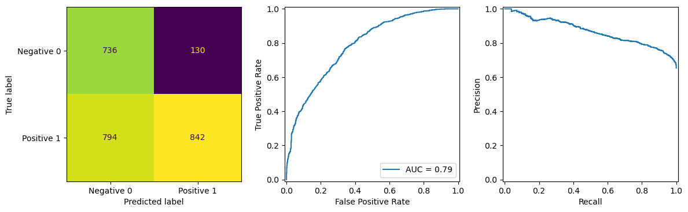
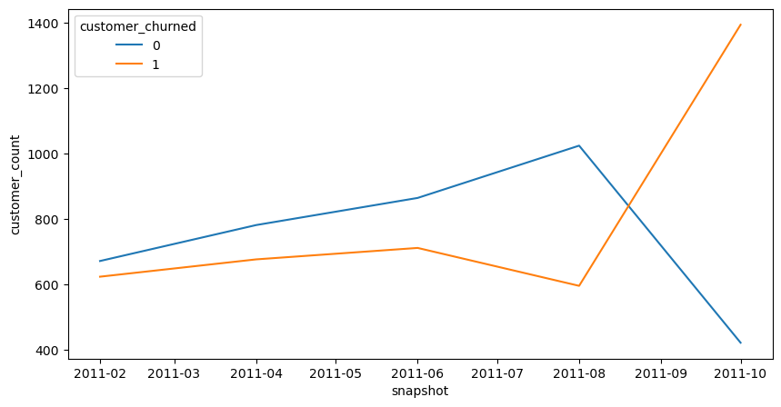

# Online Retail Customer Churn Prediction Model

## Goal
The goal of this project was to use Machine learning techniques to predict customer churn for an online retail business. the key challenge of this project was to build a prediction model using data that was not optimised for this type of machine learning task. For this project I had to engineer features from scratch using a combination of Pandas and SQL. I used Logistic Regression as a base model and a gradient boosted tree classifier as an optimised model.

## Results
The model had a precision of 87% and an AUC of 0.79 using the standard 0.5 decision threshold however the models overall accuracy was only 63%. The primary reason for the low accuracy is the difference in actual churn percent between the the training and test data; training data had an actual churn rate of 38% whereas the test data had a churn rate of 65%. The penultimate snapshot Oct - Dec was chosen for the test data (Final snapshot doesn't have target labels), I believe the increase in customer churn comes from seasonal trends which the model does not have enough data to capture therefore model accuracy could be improved if seasonal data was available.

## Dataset
This dataset comes from the UCI Machine Learning Repository it is the Online Retail dataset and contains transactional data for a UK based online retailer who mainly sell "unique all-occassion gifts". A lot of customers are wholesale businesses.

# Model Performance

# Customer Churn Over Time

